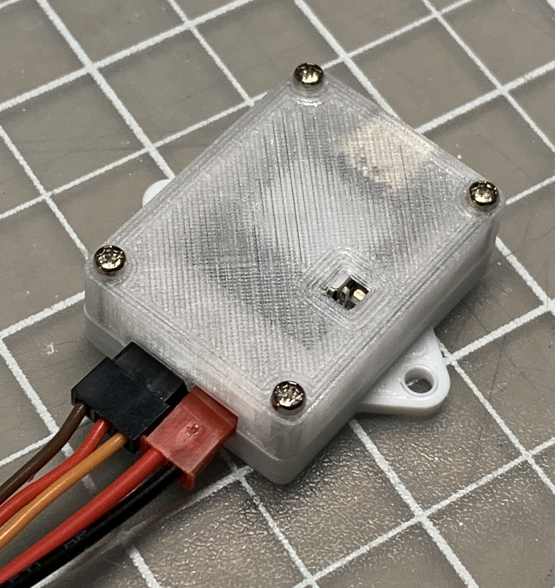

# 3D Printed Enclosure for the Climb_and_Dive timer

Download the .stl files above to print a casing to house a complete timer assembly.  The casing is not completely weather tight but should add a layer of protection.

Assemble the top and bottom using (4) M2 x 10 machine screws.

