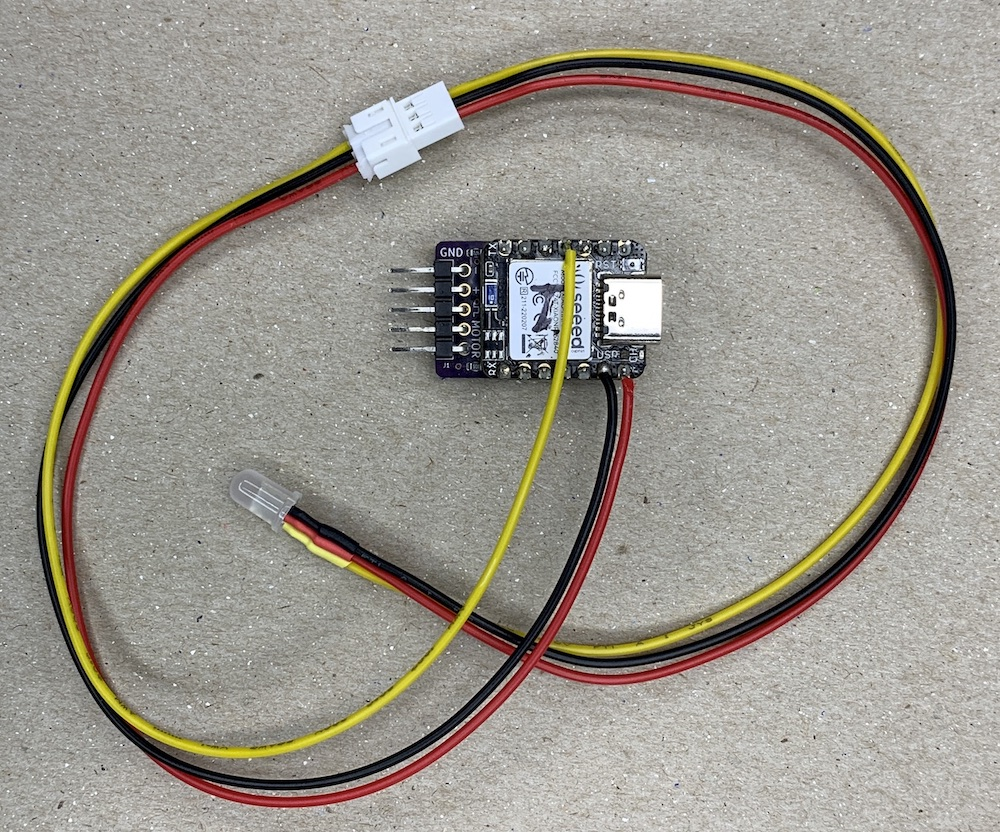

## **Climb_and_Dive** ##
{: .text-blue-100}
{: .text-right}

## Advanced Modifications ##

**Overview**

To a limited extent, the Climb_and_Dive timer can be further customised to suit your particular requirements.  This section covers some of the modifications available.

These modifications are considered more advanced and are **not** required for normal operation of the timer.  They should only be considered if you have some previous electronics and/or programming experience, are confident in your abilities and have a basic  understanding of microcontroller development boards.  Care must be used with any wiring modifications to the timer to prevent permanent damage to the microcontroller.

If you wish to learn more before diving in, both [Adafruit][1] and [Sparkfun][2] can provide the supplies and equipment for experimenting and learning.   On the surface, both of these companies appear to be retailers of electronic devices for the maker community.  In reality they are best described as companies with a primary goal of education.  To that end, they encourage experimentation by offering beginner orientated electronic products along with comprehensive online learning tutorials.

**Pinouts**

Here is the official Seed Xiao NRF52840 microcontroller board pinout diagram:

As you can see each GPIO pin can be configured for use in a number of different ways.  

{: .warning }
Be careful to never short the power pins to ground.  The 5V pin can only provide a maximum of 1A.  The 3V3 (3.3 volt) pin may be able to supply up to 100mA current.  The same caution applies to any pins configured as outputs.  The GPIO pins can only source and sink a very tiny amount of current, not even enough to directly power a single LED.  Always protect any exposed solder pins with heat shrink tubing to help prevent accidental short circuits.

 

**Remote Addressable LED Indicator**

Recent code changes allow the attachment of a super-bright status LED to the timer.  NeoPixel is the name Adafruit uses to describe WS2812 addressable LEDs.  These are unique RGB LEDs with an integral control circuit inside.  They are **not** your typical 3 colour LED with a common anode/cathode.

NeoPixels have 4 connections; +5V, Ground, Data In and Data Out.  They are available in several different types and sizes of packages.  For this modification I suggest the diffused, 5mm diameter, through hole type NeoPixel.  A package of (5) NeoPixels be purchased from [Adafruit - 5mm Diffused][3] or [Sparkfun - 5mm Clear][4] as well as through other online retailers.

Although you can wire the NeoPixel directly to the timer, it’s probably a good idea to attach it using a removable connector.  One suggestion is to use a JST-PH 2.0 3-pin connector.  This type of connector will always ensure proper polarity when connecting thing up.  Both [Adafruit - Cable Matching Pair][5] and [Sparkfun - Jumper Assembly][6] have some available.  It is advisable to keep the wire length as short as possible for your particular installation.

The 5mm through hole NeoPixel connections:

  

Note the two short wires and two long wires.  the Data Out wire will not be used and can be trimmed off.  The connections required are fairly straightforward; 5V to +5V, GND to Ground and Data In to Xiao Pin A3/D3.  The wire colours supplied with your connector may be different from the ones shown here.  Double check for correct wiring before applying power for the first time.

{: .highlight }
The NeoPixel connections described above are not necessarily the ideal recommended connection circuitry but, it has been tested and works well in this particular case.

Note: If you would like to use a different Neopixel or WS2812 LED other than the one suggested above, you may have to change the pixel order in the program code for it to illuminate the correct colours.  See below for details.

 

**Additional Parameters Accessible within the Program Code**

For users that might like to modify some of the other settings written into the code I have specifically listed a few variables near the top of the code for easy access.  These variables can be changed from the default values and then saved back onto the timer using a simple text editor program on your computer.

Connect the timer to your computer using an appropriate USB data cable.  A removable drive called CIRCUITPY should appear.  Inside the drive you will find the timer program file named code.py.  Right click on the file name and select ‘Open With’ from the menu that appears.  On Mac computers, select ‘TextEdit’ to open and edit the code.py file.  On Windows computers, select ‘Notepad’ to open and edit the file.

With the file open scroll down a little until you see the list of parameters that can be customized.  Note: Do not alter the formatted structure of the program or change the names of any variables.  Only change the value assigned to each named variable.  Once you have assigned a new value simply ‘Save’ the file.  The code.py file will be written back onto the timer and the code will automatically restart and use the new value you assigned.

If you make an error, download a new copy of the latest timer code package and overwrite your copy of code.py with the new one.  Note: Please keep a record of the parameter values that you changed.  When a new code release is published you will need to go back in and change the customizable variable values again.

{: .highlight }
CircuitPython Programming 101: numerical values can be entered as integers (whole numbers) or as floats (numbers with decimal fractions).  CircuitPython automatically uses the correct type.  Text values, commonly called text strings, must always be entered between “ “ double quotation marks.  CircuitPython uses the double quotation marks to denote a text string data type.  All other punctuation marks, including spaces, are permissible and can be used between the double quotation marks.

The following table summarizes the variables available for modification:

| Variable Name | Default Value | Description |
| --- | :---: | :---: |
| blip_duration | 0.5 | Length of start-up throttle blip |
| blip_RPM | 1150 | PWM throttle setting for start-up blip |
| touch_pin_sensitivity | 100 | Sensitivity level of touch sensor |
| timer_name | “Climb & Dive vX.X” | Name displayed on Bluetooth app |
| pixel_colour | “RGB” | Order of coloured pixels |
| glide_boost | 3 | Length of high RPM at end of flight |

**Detailed Description, Restrictions and Warnings**

**blip_duration** - This is the short length of time, in seconds, that the motor operates to indicate the start of the timer sequence.  You can enter smaller or larger values if you prefer.  Too short and your ESC might not move the prop at all. 
**blip_RPM** - This is the PWM pulse width throttle setting, in microseconds, sent to the ESC during the start-up blip.  If you would like to adjust this value to speed up or slow down the motor I would suggest experimenting in 25 or 50 microsecond steps.  This is very dependant on the ESC used.  If this value is set below the minimum endpoint value the prop will not move at all. 
**touch_pin_sensitivity** - This is an arbitrary number that you can use to adjust the sensitivity of the touch pin.  Be careful using values below 30 as it may become very sensitive and easy to trigger accidentally. 
**timer_name** - If you have several timers you may like to change the name displayed on the Bluetooth app when you connect.  **Warning: the maximum number of characters (including spaces and punctuation) is limited to 26.**  If you exceed that the program code will throw an error and stop.  You may have to connect to your phone at least one time in order to see the change. 
**pixel_colour** - Neopixels come in different flavours.  Some have a pixel order of red-green-blue, "RGB", and others are green-red-blue, "GRB".  This is where you can change the pixel order in case the Neopixel you choose has the red and green colours inverted. 
**glide_boost** - This is the length of time, in seconds, that the motor runs at a higher RPM at the end of the flight sequence.  You may prefer to increase or decrease this time.

[1]: https://www.adafruit.com/
[2]: https://www.sparkfun.com/
[3]: https://www.adafruit.com/product/1938
[4]: https://www.sparkfun.com/products/12999
[5]: https://www.adafruit.com/product/5087
[6]: https://www.sparkfun.com/products/9915
