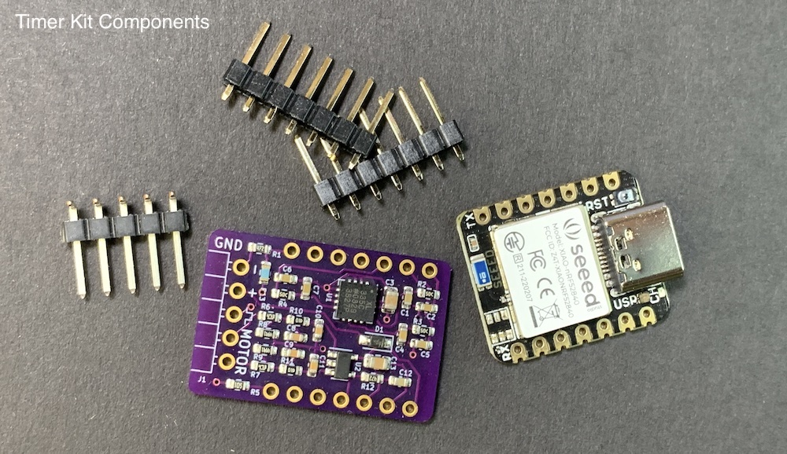
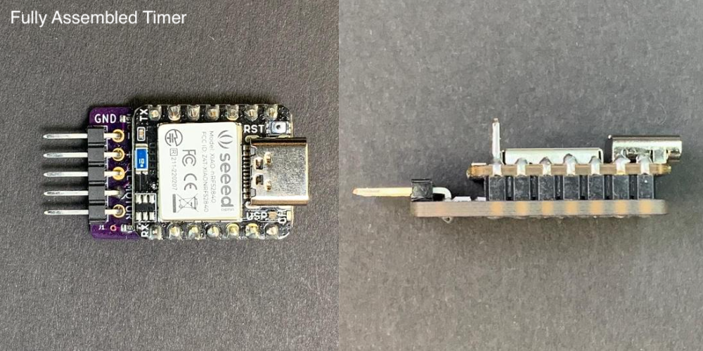
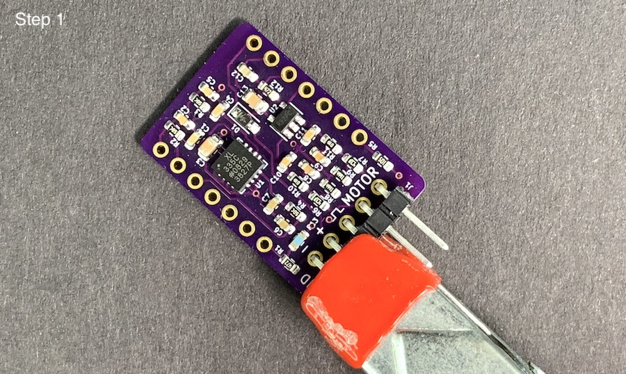
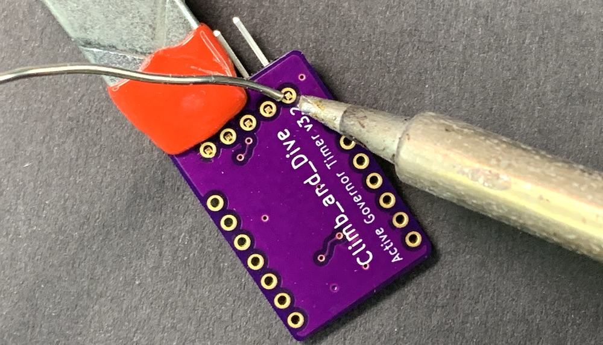
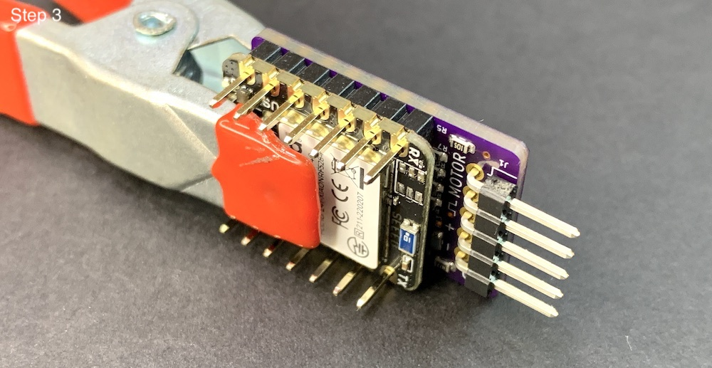
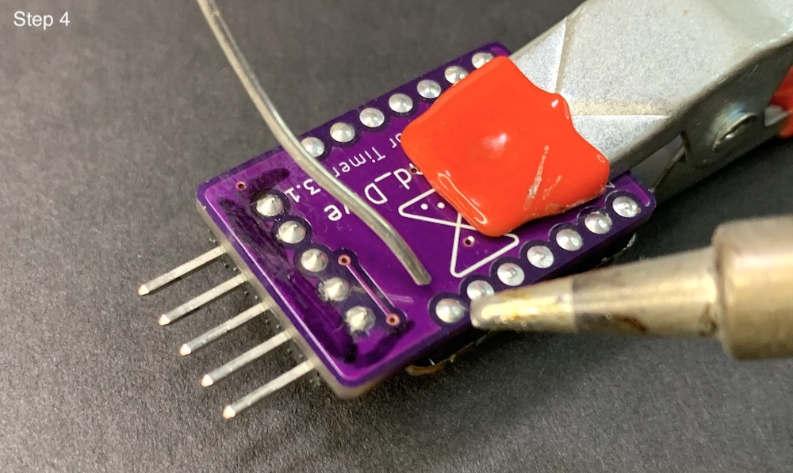
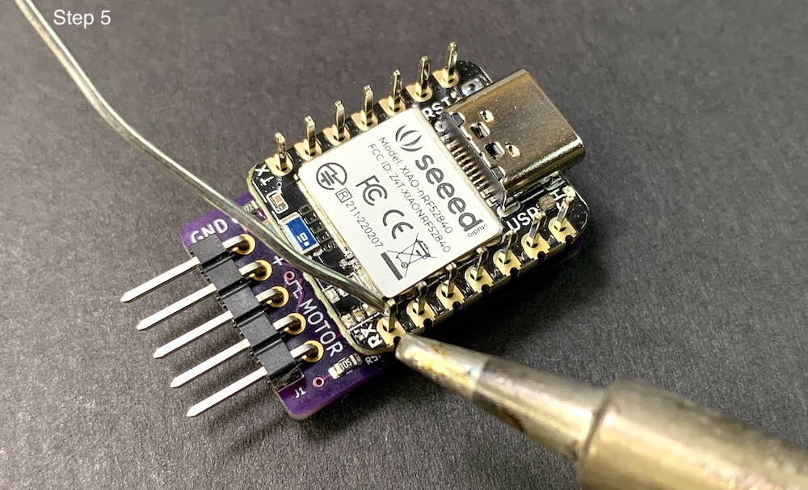
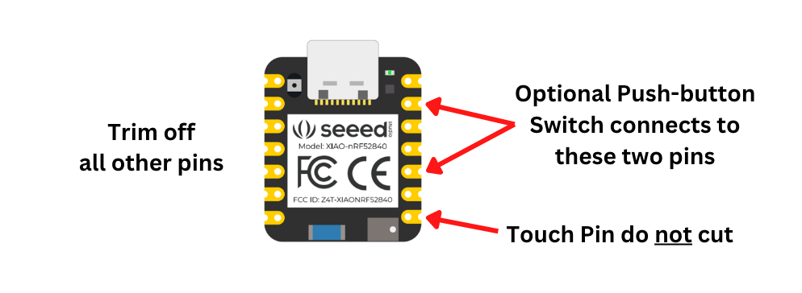
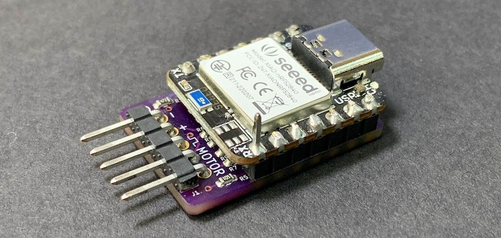

## **Climb_and_Dive** ##
{: .text-blue-100}
{: .text-right}

## Bill of Materials ##

Complete project kits can be purchased on [**Tindie**][12].  Each kit comes complete with the program code already installed and  the circuit boards fully tested.

If you prefer to purchase items separately here are some suggested sources:

| Qty | Description | Online Sources |
| :---: | ----------- | ------------- |
| 1 | Seeed Studio Xiao nRF52840 (The cheaper one, not the 'Sense' version) | [Digikey][9] [Mouser][10] [Seeed Studio][11]  |
| 1 | Climb_and_Dive Backpack w/ 5 pin RA Header Strip| [Tindie][3] |
| 1 | JST Battery Connector (Optional) | [HobbyTown][7] [Amazon][8] |

## Tools Required ##

Electronic soldering equipment; soldering iron, flux and solder.  These are available from numerous sources online.  If you need to brush-up on your electronics soldering skills there are some good tutorials on [Adafruit][1] and [Sparkfun][2].  You will also need a set of diagonal pliers or wire cutters and a small spring clamp.

{: .warning }
Do **not** use a strong acid based flux.  While this type of flux is great for home plumbing repairs and building fuel tanks, it can be very corrosive to fragile electronic circuitry. Be sure to only use a [rosin based][5] or [no-clean  type][4] flux suitable for electronics assembly.

## Timer Assembly ##

The boards as supplied include strips of breakaway header pins.  Assemble and solder as shown in the photos below.  Be careful to orient the boards correctly.  The USB C port must be on the end opposite the ESC/Motor connection pins.

---
**Step 1** - Insert the bent legs of the 5 pin right angle strip through the backpack PCB and hold with a clamp for soldering.

___
**Step 2** - Solder the pins to the back side of the backpack as shown.

___
**Step 3** - Insert the short legs of the 7 pin header strips through the holes on the top of the backpack.  Then stack the Xiao on top of the long pins and clamp together for soldering.  Make sure it is orientated as shown.

___
**Step 4** - Solder all of the short header pins on the back of the backpack.

___
**Step 5** - Flip it over and solder all of the longer header pins on the Xiao nRF52840.  Don't trim the long pins just yet.

___
**Step 6** - Now you can trim off *only* the long header pins that you don't need.  Do **not** cut the touch pin, leave it sticking out.

{: .highlight }
Note: If you prefer, the program code does include provisions to use an *optional* push-button switch instead of the touch pin.  If you want to use a push-button switch it will connect to the timer using the 2 pins as shown below.  Depending how you want to connect your switch, you may want to leave those two pins sticking out as well.  The push-button switch functions exactly the same as the touch pin.  Note: use a normally open (NO) momentary contact type switch.

___
**Step 7** - Optional: It's a good practice to remove any residual solder flux from the joints. You can do this by using an old toothbrush dipped in 99% Isopropyl alcohol, gently scrubbing away the remaining flux. This high-concentration alcohol is readily available at your local drug store.

[1]: https://learn.adafruit.com/adafruit-guide-excellent-soldering
[2]: https://learn.sparkfun.com/tutorials/how-to-solder-through-hole-soldering?_ga=2.264399628.2047829894.1668554338-987389297.1656854053
[3]: https://www.tindie.com/products/28568/
[4]: https://www.chipquik.com/store/product_info.php?products_id=330003
[5]: https://www.chipquik.com/store/product_info.php?products_id=310027
[7]: https://www.hobbytown.com/protek-rc-jst-male-connector-leads-2-ptk-5218/p23432
[8]: https://www.amazon.com/Silicone-Connector-SIM-NAT-Connectors/dp/B071XN7C43/ref=sr_1_16?crid=231ACQ422NRUB&keywords=jst+ryc&qid=1668614414&sprefix=jst+ryc%2Caps%2C89&sr=8-16
[9]: https://www.digikey.com/en/products/detail/seeed-technology-co-ltd/102010448/16652893?s=N4IgTCBcDaIIwFYCcB2AtHADGTWAseAHGgHIAiIAugL5A
[10]: https://www.mouser.com/ProductDetail/Seeed-Studio/102010448?qs=Znm5pLBrcAJ5g%252BWAkitg4w%3D%3D
[11]: https://www.seeedstudio.com/Seeed-XIAO-BLE-nRF52840-p-5201.html
[12]: https://www.tindie.com/products/28568/
