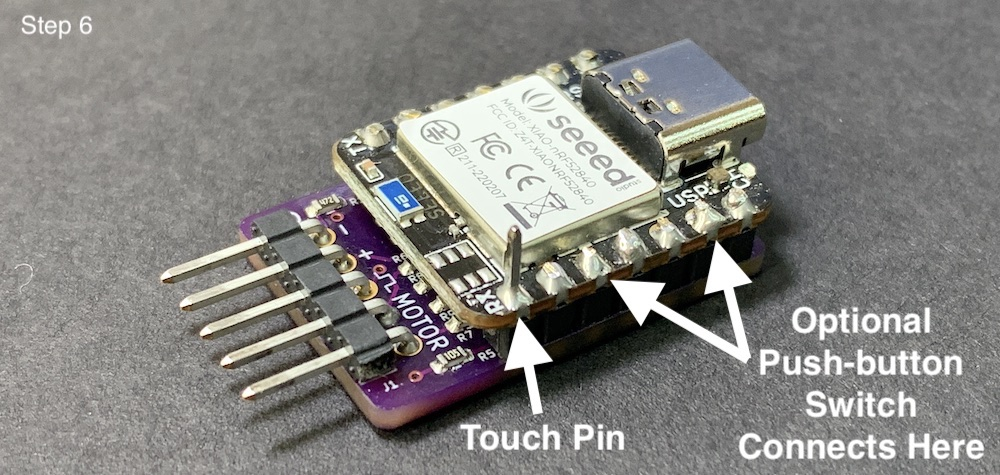
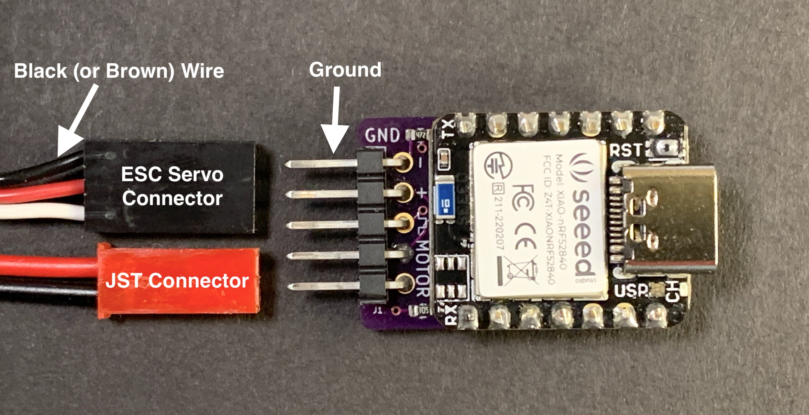
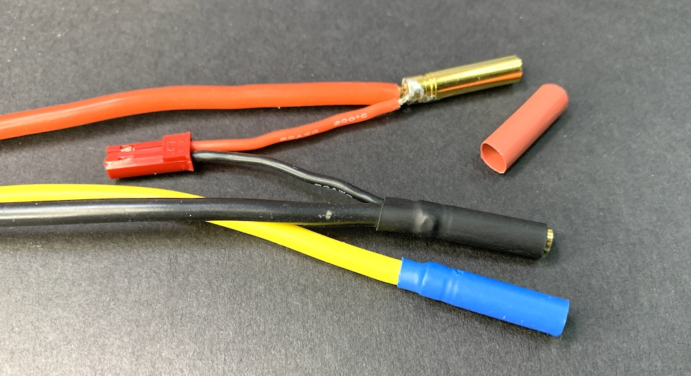
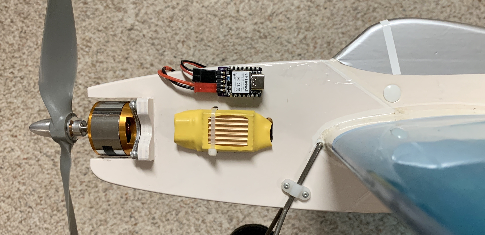

## **Climb_and_Dive** ##
{: .text-blue-100}
{: .text-right}

## Bill of Materials ##

Complete project kits can be purchased on [**Tindie**][12].  Each kit comes complete with the program code already installed and  the circuit boards fully tested.

If you prefer to purchase items separately here are some suggested sources:

| Qty | Description | Online Sources |
| :---: | ----------- | ------------- |
| 1 | Seeed Studio Xiao nRF52840 (The cheaper one, not the 'Sense' version) | [Digikey][9] [Mouser][10] [Seeed Studio][11]  |
| 1 | Climb_and_Dive Backpack w/ 5 pin RA Header Strip| [Tindie][3] |
| 1 | JST Battery Connector (Optional) | [HobbyTown][7] [Amazon][8] |

## Tools Required ##

Electronic soldering equipment; soldering iron, flux and solder.  These are available from numerous sources online.  If you need to brush-up on your electronics soldering skills there are some good tutorials on [Adafruit][1] and [Sparkfun][2].  You will also need a set of diagonal pliers or wire cutters and a small spring clamp.

## Timer Assembly ##

The boards as supplied include strips of breakaway header pins.  Assemble and solder as shown in the photos below.  Be careful to orient the boards correctly.  The USB C port must be on the end opposite the ESC/Motor connection pins.

---
**Step 1** - Insert the bent legs of the 5 pin right angle strip through the backpack PCB and hold with a clamp for soldering.

___
**Step 2** - Solder the pins to the back side of the backpack as shown.

___
**Step 3** - Insert the short legs of the 7 pin header strips through the holes on the top of the backpack.  Then stack the Xiao on top of the long pins and clamp together for soldering.  Make sure it is orientated as shown.

___
**Step 4** - Solder all of the short header pins on the back of the backpack.

___
**Step 5** - Flip it over and solder all of the longer header pins on the Xiao nRF52840.  Don't trim the long pins just yet.

___
**Step 6** - Now you can trim off *only* the long header pins that you don't need.  Do **not** cut the touch pin, leave it sticking out.

{: .highlight }
Note: If you prefer, the program code does include provisions to use an *optional* push-button switch instead of the touch pin.  If you want to use a push-button switch it will connect to the timer using the 2 pins as shown below.  Depending how you want to connect your switch, you may want to leave those two pins sticking out as well.  The push-button switch functions exactly the same as the touch pin.  Note: use a normally open (NO) momentary contact type switch.

## Connecting it All Together ##

{: .highlight }
When connecting the ESC servo connector be sure the **ground wire (brown or black)** is attached to the ground pin on the board, labeled **GND**.  

Connect the backpack motor pins to any two of the three motor wires.  It doesn't matter which two.  For convenience I use a male JST battery style connector (just for reference: the full manufacturers name is a male JST-RYC connector).  Solder the JST connector leads into the back of the bullet connectors of the ESC motor wires.

{: .highlight }
Note: The main reason a JST connector is suggested is only because it's a very common 2-pin connector available from just about any hobby shop.  It may not be the ideal connector if connected and disconnected frequently.  A more robust connector would be a 2-pin "Dupont" connector.  Unfortunately, these are a little harder to find but are available from online retailers.

## Installation ##

The flat bottom of the timer **must** be installed on a vertical part of the aircraft with the ESC/Motor connection pins pointing forward and the component side of the timer facing the pilot.  Although not super-critical, the long side of the timer should be installed so that it is horizontal when the aircraft is flying straight and level.  Calibration of the accelerometer is not required.

{: .highlight }
The description above is the **default** mounting orientation.  If you would like to install the timer in your airplane in a different orientation please refer to the page titled [Timer Mounting Position](Programming/Timer Mounting Position).

A couple of pieces of adhesive backed hook and loop fastener (aka Velcro) makes quick work of holding the timer in position.

Please keep in mind that the accelerometer is a very sensitive device and excessive vibration can make it difficult to get accurate readings.  If possible locate the timer away from any source of vibration.  It's a good idea to always balance new propellers before use.

[1]: https://learn.adafruit.com/adafruit-guide-excellent-soldering
[2]: https://learn.sparkfun.com/tutorials/how-to-solder-through-hole-soldering?_ga=2.264399628.2047829894.1668554338-987389297.1656854053
[3]: https://www.tindie.com/products/28568/
[7]: https://www.hobbytown.com/protek-rc-jst-male-connector-leads-2-ptk-5218/p23432
[8]: https://www.amazon.com/Silicone-Connector-SIM-NAT-Connectors/dp/B071XN7C43/ref=sr_1_16?crid=231ACQ422NRUB&keywords=jst+ryc&qid=1668614414&sprefix=jst+ryc%2Caps%2C89&sr=8-16
[9]: https://www.digikey.com/en/products/detail/seeed-technology-co-ltd/102010448/16652893?s=N4IgTCBcDaIIwFYCcB2AtHADGTWAseAHGgHIAiIAugL5A
[10]: https://www.mouser.com/ProductDetail/Seeed-Studio/102010448?qs=Znm5pLBrcAJ5g%252BWAkitg4w%3D%3D
[11]: https://www.seeedstudio.com/Seeed-XIAO-BLE-nRF52840-p-5201.html
[12]: https://www.tindie.com/products/28568/
