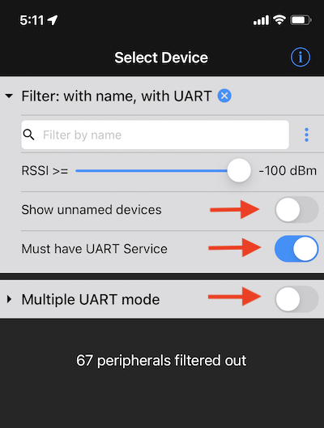

## **Climb_and_Dive** ##
{: .text-blue-000}
{: .text-right}

## Bluetooth App Installation ##

The preferred Bluetooth app is called ***Bluefruit Connect*** published by Adafruit industries and is available as a free download from both [Android Google Play][2] or from the [Apple App Store][1].  Adafruit publishes this app as a generic Bluetooth, or BLE (Bluetooth Low Energy), development tool for programmers and hobbyists to experiment with the various Bluetooth enabled development boards that they offer.

The app is capable of several different tasks.  Communication with the Climb_and_Dive timer only requires the use of the UART Service.  Pairing is not required.

Download and install the app.  Open the app and set it up as shown below.
- Show unnamed devices **OFF**
- Must have UART Service **ON**
- Multiple UART mode **OFF**

That's all you really need to know about the app.  Using the app with the timer is covered in the programming section of the operating instructions.  If you have a questions or would like to learn more about the app, Adafruit has detailed tutorial [here][3].

[1]: https://apps.apple.com/ca/app/bluefruit-connect/id830125974
[2]: https://play.google.com/store/apps/details?id=com.adafruit.bluefruit.le.connect&hl=en_CA&gl=US&pli=1
[3]: https://learn.adafruit.com/bluefruit-le-connect/ios-setup
