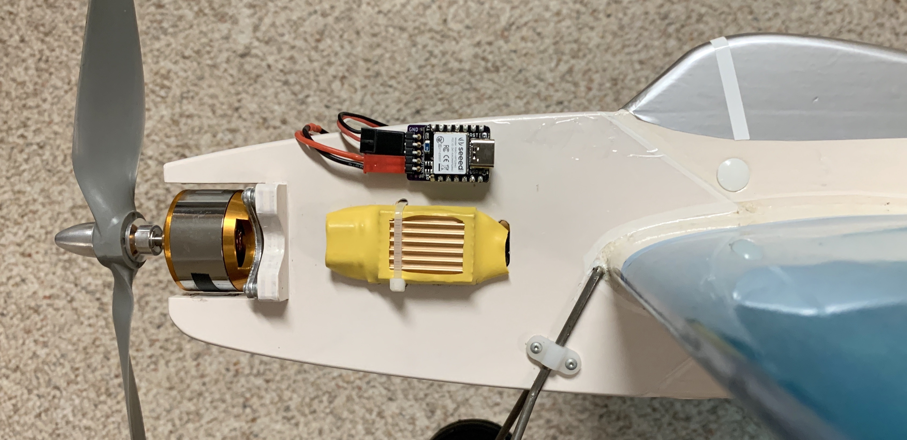
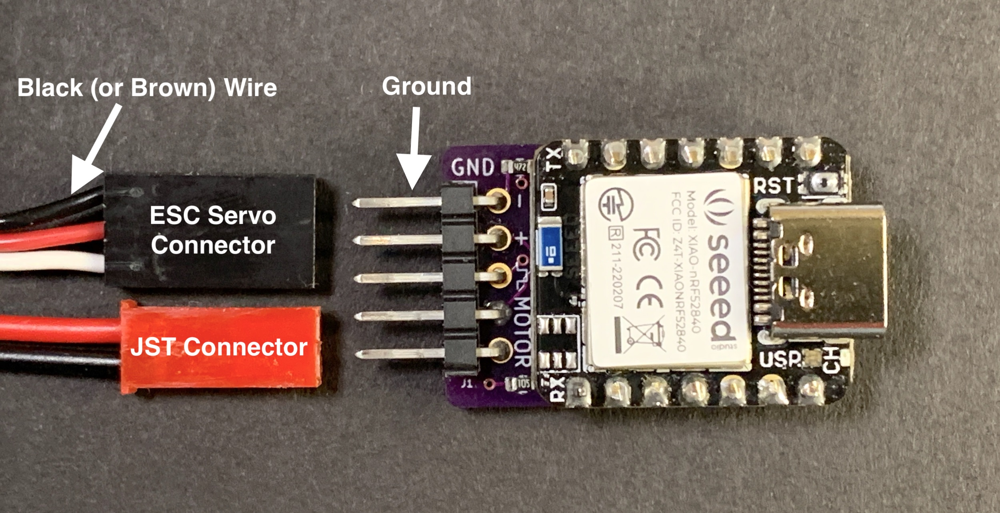
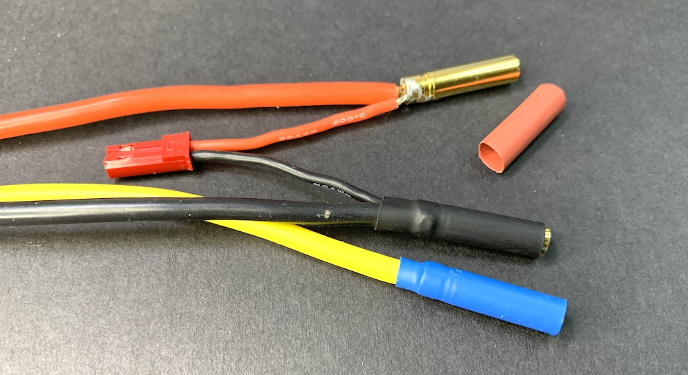
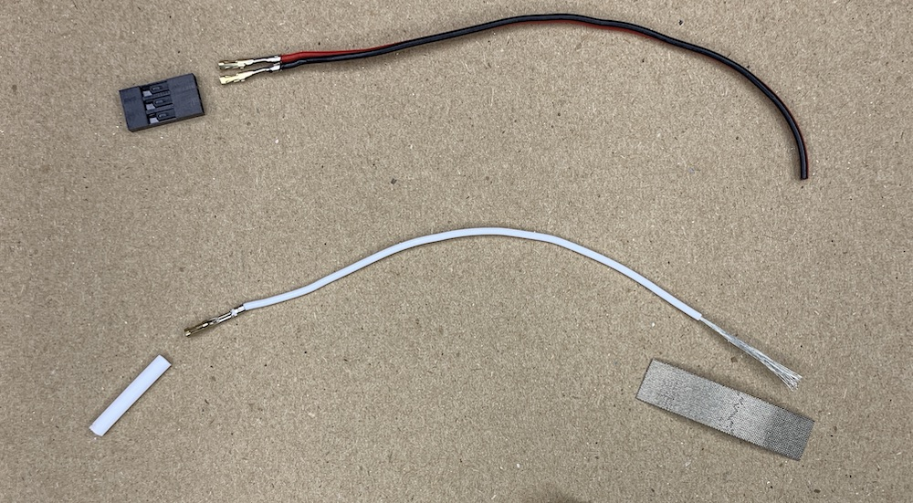
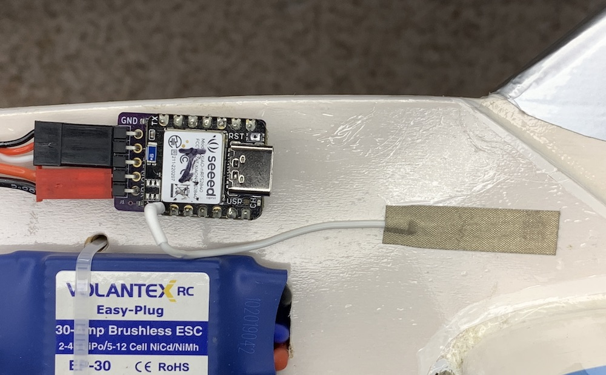
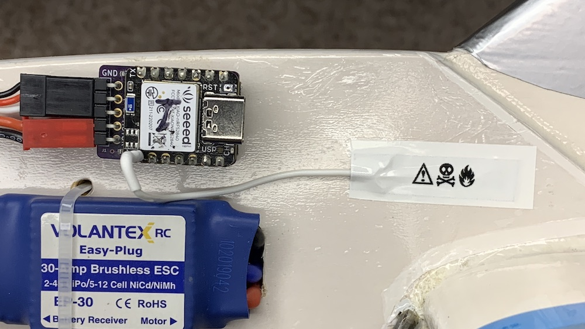

## **Climb_and_Dive** ##
{: .text-blue-100}
{: .text-right}

## Installation ##

The flat bottom of the timer **must** be installed on a vertical part of the aircraft with the ESC/Motor connection pins pointing forward and the component side of the timer facing the pilot.  Although not super-critical, it is important that the long side of the timer is installed so that it is horizontal when the aircraft is flying straight and level.  Calibration of the accelerometer is not required.

{: .highlight }
The description above is the **default** mounting orientation.  If you would like to install the timer in your airplane in a different orientation please refer to the page titled [Timer Mounting Position](Programming/Timer Mounting Position).

A couple of pieces of adhesive backed hook and loop fastener (aka Velcro) makes quick work of holding the timer in position.

Please keep in mind that the accelerometer is a very sensitive device and excessive vibration can make it difficult to get accurate readings.  If possible locate the timer away from any source of vibration.  It's always a good idea to balance new propellers before use.

## Connecting it All Together ##

{: .highlight }
When connecting the ESC servo connector be sure the **ground wire (brown or black)** is attached to the ground pin on the board, labeled **GND**.  

Connect the backpack motor pins to any two of the three motor wires.  It doesn't matter which two.  For convenience I use a male JST battery style connector (just for reference: the full manufacturers name is a male JST-RYC connector).  Solder the JST connector leads into the back of the bullet connectors of the ESC motor wires.

{: .highlight }
Note: The main reason a JST connector is suggested is only because it's a very common 2-pin connector available from just about any hobby shop.  It may not be the ideal connector if connected and disconnected frequently.  A more robust connector would be a 2-pin "Dupont" connector.  Unfortunately, these are a little harder to find but are available from online retailers.

## Optional Modifications ##

The following items are not necessary for normal operation of the timer.  They are listed here only as additional information that may pertain to your particular installation requirements.

**Touch Pin Options**

The touch sensor pin works by sensing a change in capacitance of the exposed header pin.  The conductivity of everyones fingertip is a little different and in some cases you may find the touch the sensor pin does not working reliably to your satisfaction.  The small pin limits the surface area in contact with your fingertip.

The best way to increase the sensitivity of the pin is to increase the contact surface area of the 'sensor'.

One simple method to increase the area is to apply a short pieces of electrically conductive tape to the exterior of the airplane.  A length of wire can then be used to connect the timer sensor pin to the conductive tape.  The increased area of the conductive tape greatly improves the operation of the touch sensor.  The exposed tape is the most sensitive but, at the cost of a slight reduction in sensitivity the tape can be hidden underneath iron on covering, paint, dope or a thin vinyl decal and it still works!  This option works great for airplanes with a full body fuselage.

Adafruit has both flexible [nylon conductive tape][1] and not so flexible [copper conductive tape][2]. A search on Amazon for conductive cloth tape, conductive nylon adhesive tape or faraday cloth tape also turned up several suitable choices.  The adhesive is also conductive so connecting the wire is as easy as applying the tape over the striped end of the wire.  A female servo connector pin crimped onto the other end of the wire allows for a removable connection to the timer touch sensor pin.

[1]: https://www.adafruit.com/product/3960
[2]: https://www.adafruit.com/product/3483
