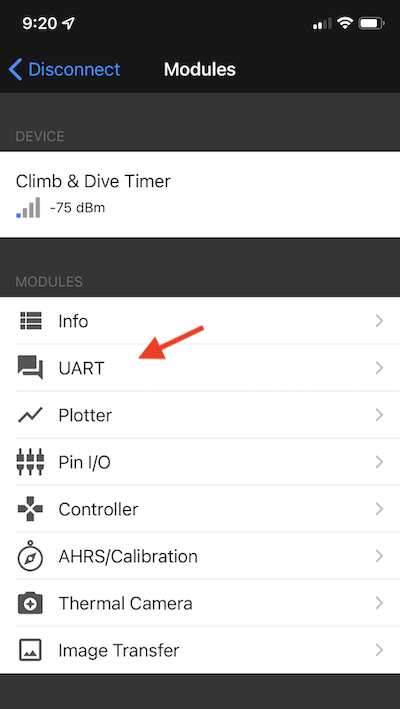
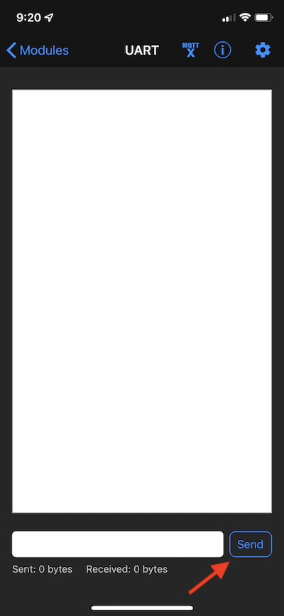
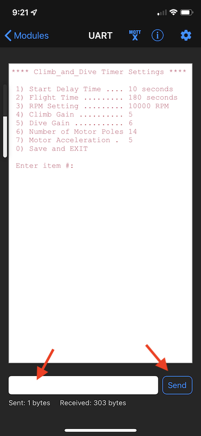
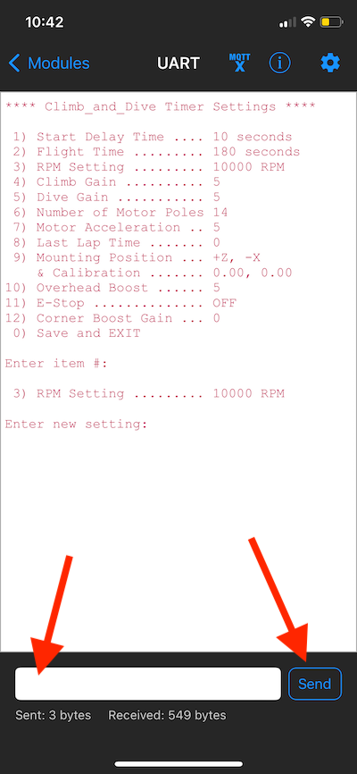
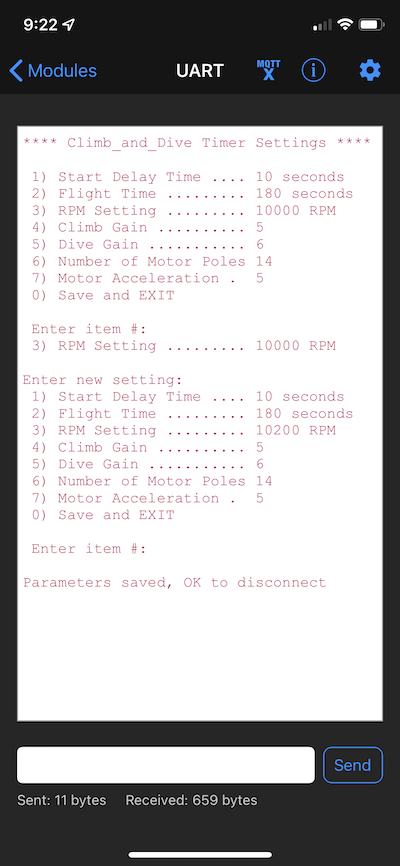

## **Climb_and_Dive** ##
{: .text-blue-000}
{: .text-right}

## Bluetooth Programming Instructions ##

### Settings ###

There are several features of the the timer that you can customize based on a user programmable setting.

**Start Delay Time** 
The start delay is programmable from 0 to 60 seconds in 1 second intervals.  This is the time delay between the motor blip when the timer sequence begins and when the motor starts up for take-off.  This gives the pilot time to walk to the handle and get ready before the motor starts.

**Flight Time** 
The flight time can be set from 1 second to 360 seconds (6 minutes) in 1 second intervals.  This time begins when the motor reaches full flight RPM and lasts until the 3 second period of increased RPM just before the motor stops at the end of the flight.

**Motor RPM** 
The governed RPM can be set from 5000 RPM to 15000 RPM in 10 RPM increments.  This setting is the base RPM (or setpoint) that the PID control loop inside the timer will use to control the ESC. This control loop will work to maintain a constant RPM throughout the flight even as the battery voltage decreases.

**Climb Gain** 
The climb gain is an arbitrary multiplier with a value from 0 through 10 (integer values only).  This number is used to multiply the output of the accelerometer reading and adds the results to the setpoint to increase the RPM slightly when the model is in a climb.  0 turns the accelerometer input off and a setting of 10 would be the maximum RPM boost possible.  Most pilots will likely use a setting between 4 and 6.

**Dive Gain** 
The dive gain is an arbitrary multiplier with a value from 0 through 10 (integer values only).  This number is used to multiply the output of the accelerometer reading and subtracts the results from the setpoint to decrease the RPM slightly when the model is in a dive.  0 turns the accelerometer input off and a setting of 10 would be the maximum braking effect possible.  Most pilots will likely use a setting between 4 and 6.

**Motor Acceleration** 
The motor acceleration is an arbitrary multiplier with a value from 1 through 10 (integer values only).  This number is used to adjust the amount of time that the motor takes to startup at take-off.   A setting of 1 is a very slow acceleration of the motor RPM and a setting of 10 is a very quick startup.

**Number of Motor Poles** 
Enter the number of magnetic poles used in your motor.  The timer needs this information in order to accurately calculate the RPM.  The number of magnetic poles  can be found in you motor documentation or by counting the number of magnet segments glued around the inside of the rotating part of the motor.

The table below summarizes the programmable settings available and their default values:

| Programmable Setting | Allowable Range | Default Setting |
| --- | :---: | :---: |
| Start Delay Time | 0 to 60 | 10 Seconds |
| Flight Time | 1 to 360 | 180 Seconds |
| Motor RPM | 5000 to 15000 | 10000 |
| Climb Gain | 0 to 10 | 5 |
| Dive Gain | 0 to 10 | 5 |
| Motor Acceleration | 1 to 10 | 5 |
| Number of Motor Poles | 2 to 24 | 14 |

 

### Programming the Timer ###

**Step 1** - Connect the battery and boot up the timer.

**Step 2** - Tap your finger on the touch pin 5 times. The LED should turn a steady yellow (Programming mode, or more specifically Program Start Delay mode).

**Step 3** - Open the Bluefruit Connect app on your phone. Give it a second to search for the timer and the Climb & Dive timer should show up.

**Step 4** - Press the **Connect** button.  After a connection is established, the next page will automatically open to display the modules available.  Once connected the timer LED will change to a steady blue (BLE Program mode)

**Step 5** - Select the **UART** module.

The UART module will open but the screen will be blank.

**Step 6** - Tell the timer that you now have the screen open by hitting the **Send** button once.  The timer will respond and list all of the current settings.

**Step 7** - Enter the *item number* of the setting you would like to change into the text box then hit **Send**.  The timer will then show the current setting and ask for the new one.

**Step 8** - enter the new setting you would like and press **Send**.  The timer will then list all of the parameters again including the one you just changed.

Repeat steps 7 and 8 for any other settings you would like to change.  

**Step 9** - When you are finished enter *item number 0* to save the settings and disconnect.  The timer LED will change to green (Standby mode).

**Step 10** - On the app main screen it is now safe hit the OK button to disconnect and then close the app.

