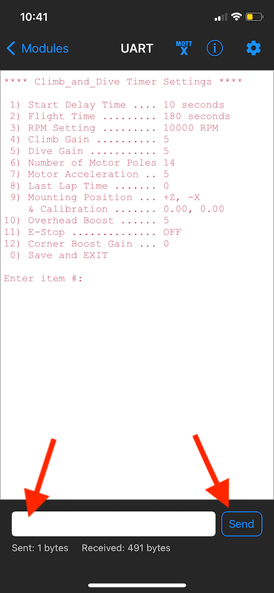
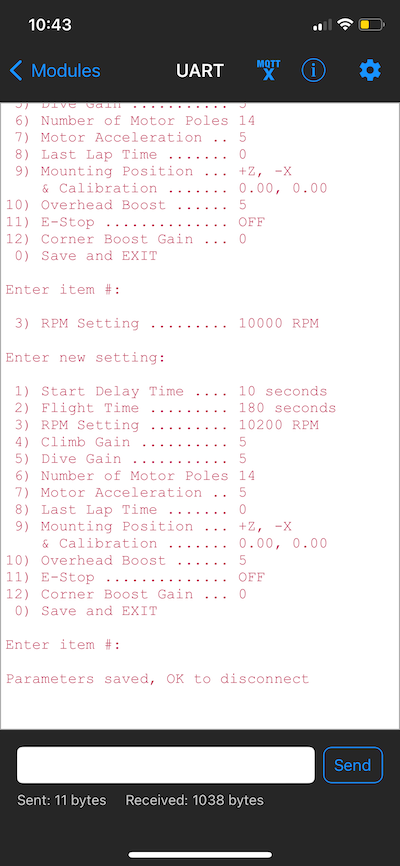



## Bluetooth Programming Instructions ##

### Settings ###

There are several features of the the timer that you can customize based on a user programmable setting.  Bluetooth 'pairing' is not required.

**Start Delay Time** 
The start delay is programmable from 0 to 60 seconds in 1 second intervals.  This is the time delay between when the timer flight sequence begins and when the motor starts up for take-off.  This gives the pilot time to walk to the handle and get ready before the motor starts.

**Flight Time** 
The flight time can be set from 1 second to 360 seconds (6 minutes) in 1 second intervals.  This time begins when the motor reaches full flight RPM and lasts until the 3 second period of increased RPM just before the motor stops at the end of the flight.

**Motor RPM** 
The governed RPM can be set from 5000 RPM to 15000 RPM in 10 RPM increments.  This setting is the base RPM (or setpoint) that the PID control loop inside the timer will use to control the ESC. This control loop will work to maintain a constant RPM throughout the flight even as the battery voltage decreases.

**Climb Gain** 
The climb gain is an arbitrary multiplier with a value from 0 through 10 (integer values only).  This number is used to multiply the output of the accelerometer reading and adds the results to the setpoint to increase the RPM slightly when the model is in a climb.  0 turns the accelerometer input off and a setting of 10 would be the maximum RPM boost possible.  Most pilots will likely use a setting between 4 and 6.

**Dive Gain** 
The dive gain is an arbitrary multiplier with a value from 0 through 10 (integer values only).  This number is used to multiply the output of the accelerometer reading and subtracts the results from the setpoint to decrease the RPM slightly when the model is in a dive.  0 turns the accelerometer input off and a setting of 10 would be the maximum braking effect possible.  Most pilots will likely use a setting between 4 and 6.

**Motor Acceleration** 
The motor acceleration is an arbitrary multiplier with a value from 1 through 10 (integer values only).  This number is used to adjust the amount of time that the motor takes to startup at take-off.   A setting of 1 is a very slow acceleration of the motor RPM and a setting of 10 is a very quick startup.

**Number of Motor Poles** 
Enter the number of magnetic poles used in your motor.  The timer needs this information in order to accurately calculate the RPM.  The number of magnetic poles  can be found in you motor documentation or by counting the number of magnet segments glued around the inside of the rotating part of the motor.

**Last Lap Time** 
Enter the amount of time from 0 to 10 seconds that you would like the motor to run at normal speed *after* the short burst of high RPM at the end of the flight.  If you prefer to use the short burst of high RPM to set-up for a better landing glide, set this time to 0.  If you prefer the use the short burst of high RPM as a warning signal to indicate the end of the flight, enter a length of time that allows you prepare for landing.

**Mounting Position & Calibration** 
This option is required and must be completed prior to using the Corner Boost feature described below. For further information and details of the programming procedure, please refer to the page titled [Timer Mounting Position & Calibration](Timer Mounting Position & Calibration).

**Overhead Boost** 
The overhead boost setting is an arbitrary multiplier with a value from 0 through 10 (integer values only).  This number is used to adjust the amount of extra motor RPM that is added when flying high overhead.  0 turns the feature off and a setting of 10 would give the maximum boost in RPM when flying overhead.  Most pilots will likely use a setting between 4 and 6.

**Corner Boost Gain** 
The corner boost setting is an arbitrary multiplier with a value of 0 thru 10 (integer values only).  This number is used to adjust the amount of extra motor RPM that is added when flying the lower altitude sharp corners required for certain aerobatic maneuvers.  A sharp turn can slow the airplane down.  Adding an extra boost of power in the turn can help maintain airspeed.  0 turns the feature off and a setting of 10 would give the maximum boost in RPM during a sharp turn.  Most pilots will likely use a setting of 4 or 5. **Note:** this feature is only available after the [Timer Mounting Position & Calibration](Timer Mounting Position & Calibration) procedure has been completed.

**E-Stop** 
The emergency stop feature can be used to end the flight before the normal programmed flight time is complete.  This feature has three settings; OFF, TEST and ON.  For the complete details on how it is activated and used please see the page entitled [Emergency Stop](Emergency Stop).

The table below summarizes the programmable settings available and their default values:

| Programmable Setting | Allowable Range | Default Setting |
| --- | :---: | :---: |
| Start Delay Time | 0 to 60 | 10 Seconds |
| Flight Time | 1 to 360 | 180 Seconds |
| Motor RPM | 4000 to 15000 | 10000 |
| Climb Gain | 0 to 10 | 5 |
| Dive Gain | 0 to 10 | 5 |
| Motor Acceleration | 1 to 10 | 5 |
| Number of Motor Poles | 2 to 24 | 14 |
| Last Lap Time | 0 to 10 | 0 |
| Mounting Position| - | +Z, -X |
| & Calibration| - | 0.0, 0.0 |
| Overhead Boost | 0 to 10 | 5 |
| Corner Boost| 0 to 10 | 0 |
| E-Stop | OFF, TEST, ON | OFF |

 

### Programming the Timer ###

**Step 1** - Connect the battery and boot up the timer.

**Step 2** - Tap your finger on the touch pin 5 times. The LED should turn a steady yellow (Programming mode, or more specifically Program Start Delay mode).

**Step 3** - Open the Bluefruit Connect app on your phone. Give it a second to search for the timer and the Climb & Dive timer should show up.

**Step 4** - Press the **Connect** button.  After a connection is established, the next page will automatically open to display the modules available.  Once connected the timer LED will change to a steady blue (BLE Program mode)

**Step 5** - Select the **UART** module.

The UART module will open but the screen will be blank.

**Step 6** - Tell the timer that you now have the screen open by hitting the **Send** button once.  The timer will respond and list all of the current settings.

 Click here if your page doesn't look like the one above.

Your Bluefruit Connect UART page may look different if you may have the Display Mode set to Timestamp and not Text.

Under the gear shaped icon in the top righthand corner you will find the drop-down menu to change the Display Mode.

Change the Display Mode to **Text**.

Close the menu and now your page will be less cluttered without the timestamp information.

Moving on:

**Step 7** - Enter the *item number* of the setting you would like to change into the text box then hit **Send**.  The timer will then show the current setting and ask for the new one.

**Step 8** - Enter the new setting you would like to use and press **Send**.  The timer will then list all of the parameters again including the one you just changed.

Repeat steps 7 and 8 for any other settings you would like to change.  

**Step 9** - When you are finished enter ***item number 0*** to save the settings and disconnect.  The timer LED will change to green (Standby mode).

**Step 10** - Tap on the **Modules** button in the top left of the screen to return to the Modules page.  Then tap on the **Disconnect** button in the top left again to return to the opening screen.  On the app main screen it is now safe to hit the **OK** button to disconnect and then close the app.

