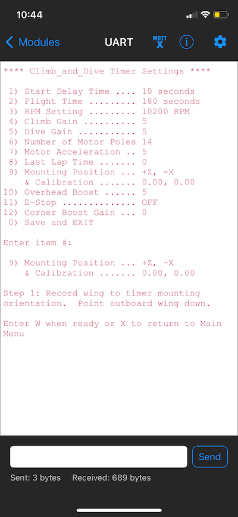
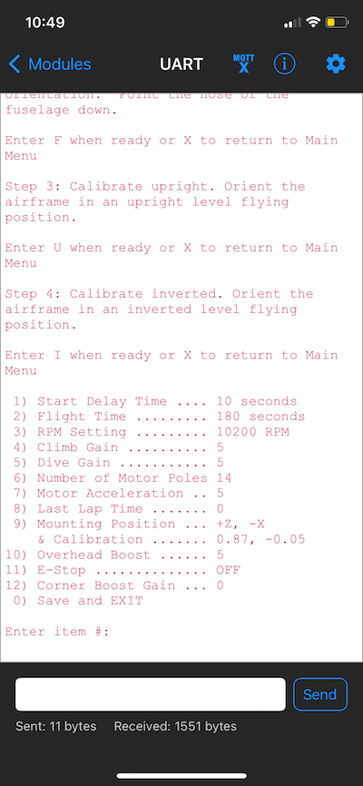



## Programming the Timer Mounting Position ##

### Description ###

{: .highlight }
Note: If upgrading to v1.5 - The following instructions have been revised to include additional steps to include calibration of the accelerometer.  This calibration is required before you can program the new corner boost feature.

The following instructions apply if you would like to install the timer on your airplane in an orientation other than the **default** mounting position described in the [assembly instructions](../Assembly#installation).  If you are using the default mounting position, the timer is already programmed with the default settings and is ready to use.

The programming procedure for this feature is slightly different than the other items in the Bluetooth programming menu so therefore warrant more detailed instructions.  This procedure only needs to be done once after mounting the timer in the airplane, or if you change the timer orientation for any reason.

**Overview** 
First, a brief explanation of why this is necessary.  The accelerometer used by the timer actually has (3) separate accelerometers inside.  Each measurement axis is orientated 90 degrees to each other.  In addition, each measurement axis has a positive and negative direction.

It is imperative that the timer uses the correct measurement axis and direction for the active output calculations.  If the timer is installed in a different orientation with respect to the wings and fuselage of the airplane, the timer will need to be reprogrammed to tell it which measurement axes to use.

The timer can be installed in any position.  Although, it still must be installed so that the sides and edges of the timer are aligned with the major axes of the airplane.  The timer *cannot* be mounted askew, tilted or at an angle to the wing and fuselage axes.

The accelerometer provided on the timer circuitboard will have some inherent discrepancies with known conditions.  The basic two point calibration procedure described here will allow the timer to automatically calculate the scale factor and the offset necessary to correct for any discrepancy.

**Programming** 
Programming the timer for both mounting position and calibration is a four step process.  

{: .highlight }
Safety first: You are about to connect the battery to power-up the airplane.  Although you will only enter the Bluetooth programming mode, for maximum safety remove the propeller or get someone to securely hold the airplane at all times.

With the timer installed in the airplane, power it up and enter the Bluetooth programming mode.  From the menu selections choose the Mounting Position & Calibration option.

**Step 1** 
Follow the onscreen prompt and hold the airplane with the outboard wing pointing down (leadouts pointing up to the sky).  When you are ready, enter the letter "W" to tell the timer this is the accelerometer axis you want to use for the wing axis.  There is also an option to enter "X" if you want to exit the procedure and return to the main menu without making and changes.

**Step 2** 
Next, the prompt will ask you to rotate the airplane so that the fuselage is vertical with the nose pointed down and the rudder pointing up to the sky.  When you are ready, enter the letter "F" to tell the timer this is the accelerometer axis you want to use for the fuselage axis.  Again, there is also an option to enter "X" if you want to exit the procedure and return to the main menu without making any changes.

**Step 3** 
Next, the prompt will ask you to rotate the airplane so that both the wings and fuselage are level in an upright normal flying attitude. Note: this does not have to be precise, within a few degrees of level should suffice. When you are ready, enter the letter “U” to tell the timer to record a reading in this position. Note: the model must be held steady and not moving while it reads the sensor.  Again, there is also an option to enter “X” if you want to exit the procedure and return to the main menu without making any further changes

**Step 4** 
Finally, the prompt will ask you to rotate the airplane so that both the wings and fuselage are level in an inverted upside down flying attitude. Note: this does not have to be precise, within a few degrees of level should suffice. When you are ready, enter the letter “I” (capital i) to tell the timer to record a reading in this position. Note: the model must be held steady and not moving while it reads the sensor.  Again, there is also an option to enter “X” if you want to exit the procedure and return to the main menu without making any further changes

**Results** 
The menu will reappear showing the new accelerometer axes assigned to the airplanes wing and fuselage axes.  The **default orientation** of the timer uses the +Z axis assigned to the wing axis and the -X axis assigned to the fuselage axis.  All other mounting orientations will use a different combination of axes and signs.

The Calibration results will be displayed as two numbers.  The first number will be used as the scale factor to correct for any slope errors.  The second number is used to offset the accelerometer readings so that they centre around 0.  Each particular timer and installation will use different values.

Be sure to **save** the new programming settings when you disconnect and exit the Bluetooth programming mode.
