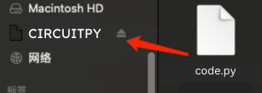

## **Climb_and_Dive** ##
{: .text-blue-100}
{: .text-right}

## Software Installation ##

One of the great features of the Climb_and_Dive timer is the ability to update the program code as new features and improvements become available.

**Note:** All Xiao NRF52840 microcontroller boards supplied through the Tindie shop are shipped ready to assemble with the latest timer program already installed and tested.  Software installation is not required and you can skip ahead to the Bluetooth app installation.

The instructions below cover two separate procedures.  The first procedure is used for a quick update to the existing program code when a newer version is released.  The second procedure is used for a more in-depth update or if you purchased a blank Xiao microcontroller board from another source.

{: .highlight}
Be sure to check here from time to time to make sure you are using the most up to date version of the program code.  **Latest Version: v1.3**

[Click Here to download the latest program code .zip file](https://github.com/CircuitFlyer/Climb_and_Dive/archive/v1.3.0.zip){: .btn .btn-blue }

The current version installed on your timer is shown in the name of the device that appears when you connect to it via the Bluetooth app.

### Quick Update of the Software: ###

If there is a newer release of the program code, use the following procedure to overwrite and replace only the one file called **code.py** on your timer.

First, a bit of background on how CircuitPython works: Whenever the timer is powered up, CircuitPython looks for a file called **code.py**, loads it into the memory and automatically begins to run the program.  The file name must be **code.py**.  Do not rename the file for or use any other file name for the program code.  This may cause confusion as both the previous version and the newest version will have the same file name.  Hence the requirement to overwrite and replace the old version with the new version, do **not** keep both.

**Step 1** - Download the .zip file from the link above.  Unzip the download and have a look inside.  You will see several different items listed there.  You are only interested in the file named **code** that has a file extension of **.py** (the python programming language file type).

**Step 2** - Connect the timer to your computer using a USB type C cable.  The timer will power up and a new removable drive called `CIRCUITPY` will appear on your computer.

{: .highlight }
A quick note about USB C cables: If you have trouble getting the disk drive to show up on your computer there is a possibility you are not using a data cable.  There may be some USB cables that are used for charging only and are not data transfer cables.  Be sure you have the right one.

**Step 3** - Drag and drop the **code.py** file from the latest download onto the `CIRCUITPY drive`. Your computer will tell you that a file with the same name is already on the drive and ask if you want to replace the file or keep both. Click **Replace**, do **not** keep both.

Give it a second while the latest version of the program code overwrites the old file.  The timer will re-start and automatically begin running the new code.  That’s it, you’re all done.  

**Step 4** - Eject the `CIRCUITPY` drive and unplug the USB cable from the timer

### In-depth Update and New Installation of CircuitPython: ###

There are two reasons why you would need to use the following procedure:

1) If you purchased a blank Xiao NRF52840 from another source you will have to perform a new installation of CircuitPython along with all of the program files and libraries.

2) Adafruit has released a new and improved version of CircuitPython. Eventually there will be a requirement to perform a more in-depth update to use the latest CircuitPython and overwrite all of the program files and libraries on your timer with the newest versions.

**Step 1** - Download the .zip file from the link above.  Unzip the download and have a look inside.  You will see several different items listed there.

**Step 2** - Connect the timer to your computer using a USB type C cable.  If you have a new blank Xiao NRF52840, nothing will happen. Don't worry, that's normal for a board that doesn't have CircuitPython installed yet.  If you are updating your existing timer a new removable drive called `CIRCUITPY` will appear on your computer.

**Step 3** - Enter Bootloader mode 

Before we install CircuitPython to the Seeed Studio XIAO nRF52840, it needs to be in bootloader mode. Enter the bootloader mode by clicking the very tiny Reset Button **twice**:

Give it a couple of seconds, then the `XAIO-SENSE` disk drive will show up:

**Step 4** - Drag the **CircuitPython .uf2** file that you downloaded and drop it onto the `XAIO-SENSE` drive. 

**Step 5** - After 15 seconds or so, the disk drive will automatically exit bootloader mode and the name will change to `CIRCUITPY`.

Congratulations, you have successfully installed CircuitPython.  

Next, install the Program Code and Library Files:

**Step 6** - Drag the complete **lib** folder that you downloaded and drop it onto the `CIRCUITPY` drive.  Your computer may ask if you want to replace the folder on the drive. Click **Replace**, don't keep the old one.  Next, drag and drop the **code.py** file onto the `CIRCUITPY` drive.  Again, **Replace** any existing versions.

Congratulations, you should now have an up to date Climb_and_Drive timer.  The LED on the Xiao should illuminate green to indicate that it's currently in Standby mode.

**Step 7** - Eject the `CIRCUITPY` drive and unplug the USB cable from the timer
