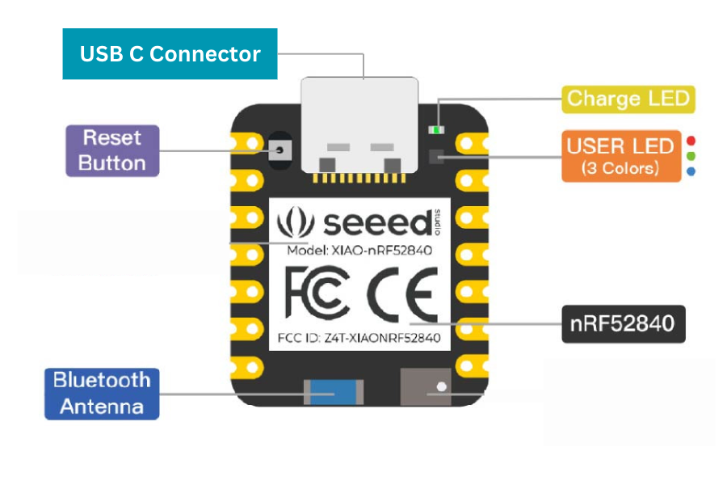
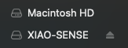
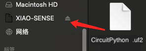
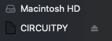
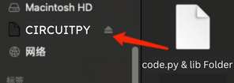

## **Climb_and_Dive** ##
{: .text-blue-100}
{: .text-right}

## Software Installation ##

If you purchased a **Climb_and_Dive kit** complete with both boards, then the Xiao microcontroller board will come preloaded with the program code already installed and tested.  You can skip ahead to the Bluetooth app installation.  Although, if there are future program updates, it is advisable to read through the following section so you are at least familiar with the programming procedure.

If you sourced your Seeed Studio Xiao nRF52840 from another provider you will have to install CircuitPython first and then the program code and libraries.  Dont' worry, it's easy.

{: .highlight}
Be sure to check here from time to time to make sure you are using the most up to date version of the program code.  **Latest Version: v1.1**

[Click Here to download the latest program code .zip file](https://github.com/CircuitFlyer/Climb_and_Dive/archive/v1.1.0.zip){: .btn .btn-blue }

Unzip the download and have a look inside.  You should find a CircuitPython .uf2 file, code.py and a lib(rary) folder.

{: .highlight }
A quick note about USB C cables: If you have trouble getting the disk drive to show up on your computer there is a possibility you are not using a data cable.  There may be some USB cables that are used for charging only and are not data transfer cables.  Be sure you have the right one.

### Installing CircuitPython on a New Xiao nRF52840: ###

Plug in your board into your computer with a USB C data cable.  It will look like nothing happened. Don't worry.  Follow this simple procedure to install CircuitPython and get the `CIRCUITPY` drive to appear.

**Step 1** - Enter Bootloader mode 
Before we install CircuitPython to the Seeed Studio XIAO nRF52840, it needs to be in bootloader mode. Enter the bootloader mode by clicking the very tiny Reset Button **twice**:

Give it a couple of seconds, then the `XAIO-SENSE` disk drive will show up:

**Step 2** - Drag the CircuitPython .uf2 file that you downloaded and drop it onto the `XAIO-SENSE` drive. 

**Step 3** - After 15 seconds or so, the disk drive will automatically exit bootloader mode and the name will change to `CIRCUITPY`.

Congratulations, you have successfully installed CircuitPython.

### Installing the Program Code and Library Files: ###
**Step 4** - Drag the complete lib folder that you downloaded and drop it onto the `CIRCUITPY` drive.  Your computer may ask if you want to replace the folder on the drive. Click **Replace**, don't keep the old one.  Next, drag and drop the code.py file onto the `CIRCUITPY` drive.  Again, **replace** any existing versions.

Congratulations, you should now have a Climb_and_Drive timer.  The LED on the Xiao should illuminate green to indicate that it's currently in Standby mode.

### Updating the Software: ###
If there are future updates to the program code, repeat **Step 4** to overwrite and replace the old code.py with the newest version.  If there is a major update, perhaps because a newer version of CircuitPython is released, then repeat **Steps 1 through 4** to replace all of the files and libraries.
