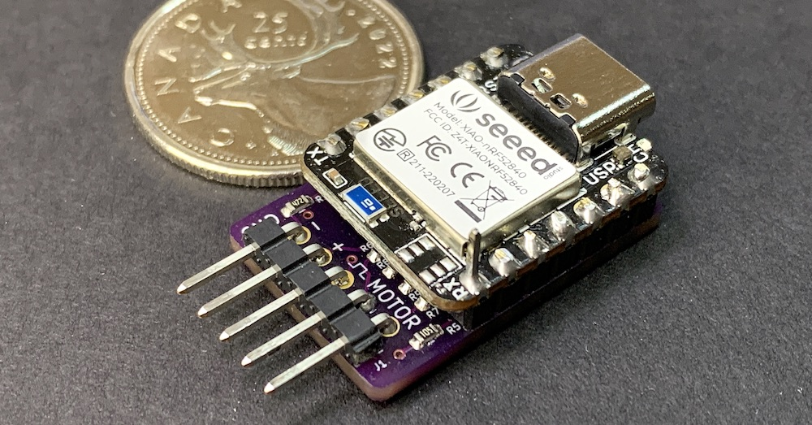


 

# Revolutionary Active Control for Electric Control Line Flying!
{: .text-center }

## What It Is
Climb_and_Dive is an open-source, do-it-yourself project that lets you build an advanced timer for electric-powered control line model aircraft. The Climb_and_Dive timer isn't just a simple switch - it's an intelligent flight control system that **actively monitors and responds** to your aircraft's flight conditions in real-time. This compact timer combines a low-cost microcontroller development board with a custom add-on circuit board to deliver professional features in a simple, user-friendly package.

## Unique Capabilities
The Climb_and_Dive timer stands out as both an **active timer** and a **governing timer** in one device. What makes it truly innovative is its **wireless programming capability** through Bluetooth and your smartphone. This eliminates the hassle of opening hatches, dealing with connectors, or using separate programming boxes.

The program code includes **built-in safety features** that provide an additional layer of protection for your power system, helping prevent damage if something unexpected occurs during operation.

Since it's open source, you have complete freedom to customize the functionality or add new features to suit your specific needs.

## Simple Assembly
The timer comes as a DIY kit that requires minimal assembly—just soldering some header pins. The kit includes two main components:

- **Seeed Studio Xiao NRF52840 development board** (the main microcontroller)
- **Custom backpack circuit board** (contains the accelerometer and RPM signal conditioning circuitry)

The backpack design streamlines wiring and makes assembly fast and straightforward.

## Easy Programming and Updates
Programming the microcontroller is incredibly simple—just drag and drop a few files on your computer. The microcontroller comes pre-programmed and tested, so you can start using it immediately.

As new features are released, you can easily [update your timer's code](docs/Software#software-installation) using the same simple drag-and-drop process, ensuring your device stays current with the latest improvements and capabilities.
   

[Click Here to order a **Climb_and_Dive** kit on **Lectronz**](https://lectronz.com/products/climb_and_dive){: .btn .btn-green}

## Extensive List of Features ##

- Dimensions: 27mm x 18mm x 9mm.  Weight: 5g.  Ideal for mounting on the side of a profile fuselage.

- An onboard accelerometer provides a programmable automatic boost in power during a climb as well as a seperate programmable decrease in power while in a dive.

- RPM throughout the flight is actively monitored and controlled by sensing the motor voltage using a feedback control loop.  No need for a tachometer.  No guesswork.  The RPM you set is the RPM you get.

- Works with lower cost ESC’s.  The governing function takes place in the timer so expensive governing ESC’s are not required.

- Wireless programming in the field via a *free* Bluetooth app using a laptop, tablet or smart phone. The start-up delay, flight time and governed RPM settings plus a lot more can be changed without any extra tools, cards or programming boxes.

- Touch sensitive pin for user input.  No additional switches or buttons to wire and mount.  If desired, the program code does provide for an optional remote push-button switch.

- Onboard multicolour LED to indicate the status of the timer.

- Functionality to add an optional remote mounted super bright Neopixel LED so the pilot can monitor the status indicator from the centre of the circle.

- The ability to improve overhead line tension by increasing the motor RPM only when flying high overhead.

- Programmable extra RPM boost in the bottom sharp corners of stunt maneuvers.

- Innovative pilot operated **emergency stop feature**.  3 quick pulls on the control handle will stop the flight so you can safely land the airplane at any time.

- Programmable soft start.  The RPM increases over a programmable time period for smoother take-offs.

- A 3 second boost in RPM at the conclusion of a flight to improve the landing glide or as a warning to indicate the impending end of the flight.

- Following a simple programming & calibration procedure the timer can be mounted in any orientation in the airplane.

- Power to the motor is cut off quickly and automatically if the propeller inadvertently strikes the ground.  No more burned out motors or ESC’s from a crash or nose-over on takeoff.

- Auto shutdown with a loss of power or a loss of motor RPM signal.

- Auto shutdown if motor fails to reach programmed RPM on takeoff.

- Should an auto shutdown occur, the onboard LED will flash a sequence of fault codes to aid in troubleshooting.

- Built-in micro USB C port.  Plug it into your computer and it shows up as a small disk drive.   This makes it very easy to keep the software up to date with the latest revisions.

- The program code is written in Adafruit CircuitPython.  CircuitPython is an easy to read and easy to learn language well supported by comprehensive [learning guides on the Adafruit website][1].

- Reprogrammable.  Have another project idea in mind?  The Xiao line of development boards have the same footprint and pinouts as the Adafruit QTPy size of boards.  The Climb_and_Dive hardware platform is also a great starting point to use in developing code for your own project.  The Xiao can also be programmed as an [Arduino device][2] if you prefer.

Congratulations to Juan Francisco Sainz Valencia, 2024 & 2025 Chilean F2B Champion and Climb_and_Dive timer advocate.

[1]: https://learn.adafruit.com/
[2]: https://wiki.seeedstudio.com/XIAO_BLE/
